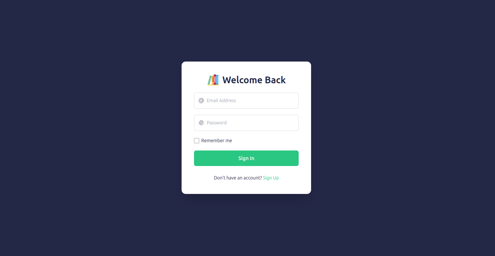
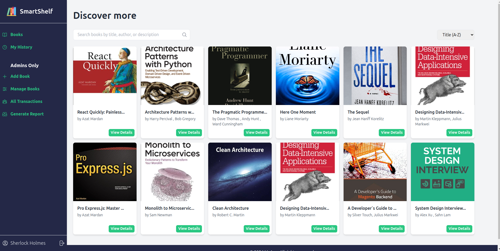
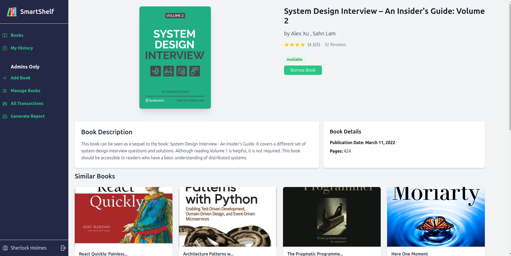

# Library Management System (LMS)

## Project Overview

The **Library Management System (LMS)** is a simple, yet scalable web application built with **Express.js** using the **MVC architecture** to manage library operations. The system allows librarians (administrators) and patrons (users) to interact with the system in different ways, ensuring smooth management of library resources. This project implements SQL queries for efficient data manipulation, server-side rendering using EJS, and role-based access control.

### **Key Features:**

#### **Librarian Functionalities:**

-   **Add/Edit/Remove Books**: Librarians can manage books in the library's catalog.
-   **View All Transactions**: The librarian can view the history of book loans.
-   **Generate Reports**: Generate reports based on library operations.

#### **User Functionalities:**

-   **Browse Book Catalog**: Users can browse available books.
-   **Borrow Books**: Users can borrow books based on availability.
-   **View Personal Loan History**: Users can view their borrowing history.
-   **Search Books**: Users can search for books in the library by title, author, or genre.

### **Authentication Strategy:**

-   Simple **role-based access control**.
-   Users are categorized as **librarians (admins)** or **patrons**.
-   Hardcoded **login simulation** with role checks for validation.
-   Middleware is used for role-based authentication and validation.

---

### **Frontend UI Overview**

The LMS frontend is designed to be intuitive and user-friendly, ensuring a smooth user experience for both librarians and patrons. The frontend is built using EJS templates for rendering dynamic content. Below are the key UI components and their functionalities:

## Login Page



## Admin Landing UI



## Single Book Page



## **Implementation Details**

### **MVC Architecture:**

-   **Models**: Represent entities such as books, users, and transactions. These models are responsible for handling data operations.
-   **Controllers**: Handle the business logic and routing for different user actions.
-   **Views**: Rendered templates using EJS for both admin and user interfaces. These views present the data in a structured and user-friendly format.

### **Database Design and SQL Skills:**

-   The database schema is designed to handle data for books, users, transactions, etc.
-   SQL queries are written to perform **CRUD operations** (Create, Read, Update, Delete) and data retrieval.
-   A **normalized database schema** is created to reduce redundancy and ensure data integrity.

### **Template Engine Integration:**

-   The **EJS templating engine** is used to render dynamic HTML views.
-   Reusable **layouts** and **partials** are implemented to streamline the views and reduce code duplication.
-   **Form handling** and **data display templates** are designed to interact with the backend system for dynamic updates.

### **Middleware:**

-   **Authentication Middleware**: Ensures that users must be logged in to access specific routes.
-   **Role-based Access Middleware**: Restricts access based on user roles (librarian or patron).
-   **Validation Middleware**: Ensures that form inputs are properly validated before being processed.

### **Error Handling and Logging:**

-   Proper error handling is implemented throughout the system to handle any potential errors during requests.
-   **Logging** is set up to capture system behavior and errors.

---

## **Installation**

### **Prerequisites:**

Ensure you have the following installed on your machine:

-   **Node.js** (LTS version)
-   **MySQL** or **PostgreSQL** for database management.

### **1. Clone the Repository:**

```bash
git clone https://github.com/julius-amt/LMS.git
cd LMS
```

### **2. Install Dependencies:**

```bash
npm install
```

### **3. Configure the Database:**

-   Set up **PostgreSQL** on your machine.
-   Create a database and update the connection details in `src/utils/dbConfig.ts` file:

    ```js
    const pool = new pg.Pool({
        host: "localhost",
        user: "postgres",
        password: "postgres",
        database: "LMSDB",
        port: 5432,
        idleTimeoutMillis: 30000,
        connectionTimeoutMillis: 2000,
    });

    (async () => {
        client = await pool.connect();
    })();
    ```

### **4. Database Setup:**

Run the SQL scripts to create the necessary tables (books, users, transactions, etc.). The database schema is designed for you to handle **book management**, **user management**, and **transactions** efficiently.

### **5. Run the Application:**

```bash
npm start
```

By default, the application will be accessible at:

-   `http://localhost:3000`

---

## **Project Structure**

The project follows a **structured directory layout** to ensure scalability and maintainability. Here's a breakdown:

```
.
├── package.json              # NPM configuration file
├── README.md                 # Project documentation
├── src                       # Application source code
│   ├── controllers           # Logic to handle routing and data
│   │   ├── auth.ts           # Authentication controllers
│   │   └── books.ts          # Book management controllers
│   ├── models                # Database models (book, user, transaction)
│   │   ├── books.ts          # Book model (handles CRUD operations)
│   │   ├── transactions.ts   # Transaction model (book borrowing data)
│   │   └── users.ts          # User model (handles user data and roles)
│   ├── public                # Static assets (images, JS, CSS)
│   │   ├── books             # Book cover images
│   │   ├── icon.png          # Favicon
│   │   └── js
│   ├── routers               # Route handling for different endpoints
│   │   ├── admin             # Admin routes (book management, reports)
│   │   ├── auth.ts           # Authentication routes (login/signup)
│   │   └── books.ts          # Book management routes (CRUD)
│   ├── utils                 # Utility functions (middleware, validation)
│   │   ├── dbConfig.ts       # Database connection configuration
│   │   ├── middleware        # Middleware functions for validation, authentication
│   │   └── types             # Typescript types for request handling
│   ├── views                 # Views (EJS templates)
│   │   ├── admin             # Admin-specific views (add, list books)
│   │   ├── auth              # Auth views (login, signup)
│   │   ├── bookDetail.ejs    # Book details view for patrons
│   │   ├── books.ejs         # Book catalog view for patrons
│   │   ├── history.ejs       # Borrowing history for patrons
│   │   ├── layouts           # Layouts for the application
│   │   └── partials          # Partials (header, footer, etc.)
└── tsconfig.json             # TypeScript configuration file
```

---

## **Usage**

### **Admin Dashboard:**

-   **Manage Books**: Librarians can add, edit, and delete books from the catalog.
-   **View Transactions**: View borrowing history and transactions.
-   **Generate Reports**: Generate reports based on library activities.

### **User Dashboard:**

-   **Browse Books**: Users can browse the available books and search by title or author.
-   **Borrow Books**: Users can borrow books and view their loan history.
-   **View Loan History**: Users can see their borrowing history.

### **Login/Signup:**

-   Patrons can sign up and log in using the **signup** and **login** pages, while librarians can access admin functionality with their login credentials.

---

## **Contributing**

Feel free to fork the repository and make improvements. To contribute:

1. **Fork** the repository.
2. **Clone** your fork to your local machine.
3. Make your changes.
4. **Commit** your changes.
5. **Push** to your fork.
6. Open a **Pull Request** with a description of your changes.

---

## **License**

This project is licensed under the MIT License - see the [LICENSE](LICENSE) file for details.

---

## **Additional Notes**

-   **Error Handling**: The system includes detailed error messages and proper logging mechanisms for easier debugging.
-   **Security**: Input validation and sanitization are implemented to prevent common attacks such as SQL injection.
-   **Performance**: Queries are optimized for efficient data retrieval.
